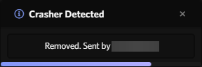

# AntiCrash

Archived due to it being bad and [a better one existing](https://github.com/1Lighty/discord-crasher-checker).

Powercord plugin that detects and removes crasher links in the current channel, The current detection method and/or code isn't that good as it's my first time using JS and Powercord's API but it will be further improved later on.
 
This plugin was initially made to fix the latest crasher as of 4/9/2021 but will continue to be updated if more methods are found.
